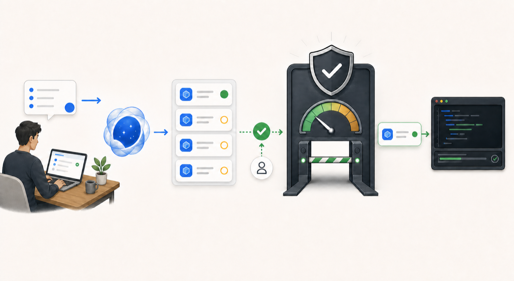

# Codex Work Scheduler

**Give your AI agent a queue of useful Codex work, while keeping you in control of what runs and how much capacity it can use.**

Codex Work Scheduler is a local tool for people who want an AI coding agent to organize, approve, run, and monitor Codex tasks over time. It keeps a durable backlog, checks your usage limits before starting work, runs one approved task at a time, and stops safely when something is unclear.

<p align="center">
  
</p>

*Conceptual overview: your agent organizes the work; you approve it; the scheduler checks the guardrails and lets one task run at a time.*

> **Public alpha:** The core workflow works and is tested, but setup, configuration, commands, and local state formats may change before beta. The alpha is distributed as source only.

## What it does

You give your AI agent goals such as “update this documentation,” “investigate this bug,” or “run this maintenance task.” The agent turns each goal into a bounded work package and places it in the scheduler.

Before Codex work starts, the scheduler checks that:

- You approved that exact package.
- Both the five-hour and weekly usage windows still have the configured reserve.
- No other task is running.
- The workspace, tools, network policy, audit history, and local state are safe.

When the checks pass, the scheduler can start one task and monitor it. If usage data disappears, the account changes, a task becomes uncertain, or another safety check fails, it pauses instead of guessing or retrying.

Everything runs locally. The queue, approvals, run state, and redacted audit history live in SQLite on your machine.

## Why it is useful

- **Let your agent manage the queue.** Describe outcomes in normal language instead of manually coordinating every scheduler command.
- **Use available capacity deliberately.** Keep useful work ready without intentionally crossing the reserves you set.
- **Approve work, not open-ended access.** Approval is tied to one unchanged package: objective, repository, model, sandbox, time limit, and usage estimate.
- **Avoid duplicate or uncertain runs.** Only one task runs at a time, and interrupted or unclear work waits for review instead of retrying automatically.
- **Keep control local.** There is no scheduler web service, new login flow, external notification service, or paid-credit fallback.

## Quick start with an AI agent

The easiest way to use the project is with Codex or another local coding agent that can read files and run terminal commands.

Prerequisites: macOS, Python 3.9 or later, Git, and the Codex CLI signed in through its normal authentication flow.

Give your agent this prompt:

```text
Set up Codex Work Scheduler for a safe local evaluation.

1. Clone https://github.com/jremick/codex-work-scheduler.git and enter the repo.
2. Read README.md, AGENTS.md, and docs/agent-usage.md before acting.
3. Copy scheduler.example.json to scheduler.local.json. Keep all runtime state local and ignored by Git.
4. Run the documented compile, test, JSON, link, and public-safety checks.
5. Read scheduler status and verify the audit chain.
6. Report whether the controller is PAUSED, dry_run is true, the audit chain is valid, and no work or service lease is active.

Do not probe my account, resume the controller, enable the background service,
create an approval, or dispatch Codex work. Stop and explain any failed check.
Do not include raw account, usage, authentication, prompt, or machine-path data
in your response.
```

The expected result is a tested local checkout with `scheduler.local.json`, a `PAUSED` controller, valid audit history, and no Codex task started.

### Manual alternative

If you prefer to use the CLI yourself:

```bash
git clone https://github.com/jremick/codex-work-scheduler.git
cd codex-work-scheduler
cp scheduler.example.json scheduler.local.json

python3 -m codex_work_scheduler --config scheduler.local.json status
python3 -m codex_work_scheduler --config scheduler.local.json audit verify
```

`scheduler.local.json` and `.scheduler/` are ignored by Git. These commands do not probe account usage or start Codex work.

## Ask your agent to manage work

Once setup is healthy, manage the scheduler with short, outcome-focused prompts. Your agent should read [`AGENTS.md`](AGENTS.md) and follow the full [AI agent guide](docs/agent-usage.md).

### Add work without running it

```text
Prepare a Codex Work Scheduler package for this goal:
"Update the installation guide and verify every command in a clean checkout."

Use this repository, choose the smallest safe sandbox, set a conservative time
and usage estimate, and explain the package in plain language. Propose it to the
scheduler, but do not approve or dispatch it. Show me the exact approval scope
and stop for my decision.
```

### Approve one exact package

```text
Review the proposed package for <job-id>. Confirm that its objective, repository,
model, sandbox, time limit, dependencies, and usage estimate have not changed.
Prepare the scoped approval request and summarize what it would authorize.
Do not create the approval file until I explicitly approve that exact scope.
```

After reviewing the scope, give a clear instruction that names the job and approval request. The agent can then materialize that approval, add the package to the approved queue, and continue only within the authority you granted.

### Let the agent run safe work

```text
Manage the approved scheduler queue. Check status, audit integrity, stale work,
and a fresh dispatch preflight. If the controller and every safety gate allow it,
dispatch at most one already-approved package. Monitor that run to a terminal or
needs-review state, then report the outcome without quoting raw quota or task output.
Do not retry uncertain work and do not start a second task.
```

### Check or stop the scheduler

```text
Read the scheduler status, queue, active run, service lease, and reconciliation
preview. Give me a short summary without raw account or quota details. If any
state is uncertain, pause new work and tell me the smallest review step needed.
```

The same workflows are available manually through the JSON CLI:

```bash
python3 -m codex_work_scheduler --config scheduler.local.json status
python3 -m codex_work_scheduler --config scheduler.local.json queue list
python3 -m codex_work_scheduler --config scheduler.local.json dispatch preflight --refresh
python3 -m codex_work_scheduler --config scheduler.local.json monitor list
python3 -m codex_work_scheduler --config scheduler.local.json pause --reason-code OPERATOR_PAUSE --idempotency-key pause-001
python3 -m codex_work_scheduler --config scheduler.local.json reconcile --dry-run
```

## How the safety model works

The included example keeps 10% of both usage windows in reserve and adds a 1.25 safety margin to each work estimate. Missing, stale, inconsistent, or account-mismatched usage data blocks new work.

Live work also requires an immutable approved package, controller mode `READY`, valid local state and audit history, concurrency one, bounded tools, network access off, and the requested workspace sandbox. A failed or interrupted task is never retried automatically.

The scheduler can reduce the chance of intentionally running into a reserve or paid credits. It cannot predict a task's final usage, make interruption instantaneous, or guarantee billing outcomes. Concurrent Codex activity can also make account-level usage changes look larger than the scheduled task's actual use.

Read the [operating model](docs/operating-model.md) for the detailed state machine and failure rules.

## Background operation

The optional foreground supervisor can poll the queue and run already-approved work, but it is disabled in the example configuration. The repository can render a disabled LaunchAgent plist to a staging path; it does not install, load, or enable launchd.

Background activation is an advanced, separately approved local operation. Start with the agent-managed foreground workflow above. See [Background service](docs/background-service.md) when you are ready to evaluate continuous operation.

## Current limits

- macOS and Python 3.9 or later are the verified baseline.
- Distribution is a source checkout; there is no package or installer.
- Config files, commands, SQLite state, and App Server integration may change during alpha.
- The project has no network API, graphical interface, external notification service, automatic retry, or paid-credit fallback.
- Live launchd installation and reboot behavior are not part of the public-alpha claim.

## Documentation

- [AI agent guide](docs/agent-usage.md) - machine-oriented operating protocol and prompt patterns
- [Getting started](docs/getting-started.md) - AI-managed setup and manual alternative
- [Operating model](docs/operating-model.md) - detailed state machine, dispatch, and recovery
- [Compatibility](docs/compatibility.md) - verified environments and current limits
- [Background service](docs/background-service.md) - optional supervisor and launchd boundary
- [Changelog](CHANGELOG.md) - public-alpha changes and safety notes

## Support, security, and contributions

- [Support](SUPPORT.md) - bugs, questions, and the alpha support boundary
- [Security policy](SECURITY.md) - private vulnerability reporting without exposing sensitive data
- [Contributing](CONTRIBUTING.md) - development setup and pull-request expectations

## License

Licensed under the [Apache License 2.0](LICENSE). Contributions are accepted under the same license unless explicitly agreed otherwise.
